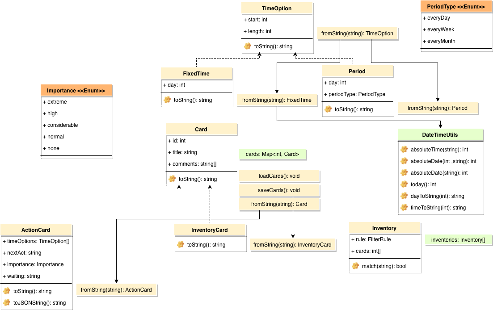

# Getting Things Done

这是一个简易的APP，用以协助管理一个GTD系统。
这个系统是大名鼎鼎的*GTD*书中所提出的系统的一个简易版本的变种。

## 简易的GTD系统

这个APP有四个页面：收集箱，行动，日历，清单。
所有卡片会被根据内容分配到四个页面中。这个分配过程是按照一定规则进行的。
如果需要改变卡片的分配，使用者需要修改卡片的内容。
只有和清单相关的规则是使用者可以修改的。

一个卡片的内容分为多行，空行被自动忽略。第一行被当做标题。其他行根据内容被识别为不同的选项。没有被识别为任何选项的行被当做纯粹的注释。

如果一个卡片包含时间选项，或者等待选项，就会被识别为行动卡片，放到行动页面中。如果一个行动卡片的时间选项包含了今天或其他指定日期，就会在日历中这一日期的页面中展示出来。

如果一个卡片的标题符合某个清单的筛选规则，它就会被放到这个清单中。

除此之外，剩下的没有被归类的卡片会被放到收集箱中。

### 行动卡片的选项

- 时间选项：时间选项可以只包含日期、一天中的时间，或者两者都包含。日期可以是相对日期，比如今天、明天、后天、大后天，周一、周二、下周一、下周二，15号。也可以是绝对日期，7月20日、2019-7-21。一天中的时间只能是绝对时间，格式可以有上午8:30、上午8点30、上午8点30分、上午8点半、8:30、14:30、下午2:30等等。

相对日期的解析尽量按照一般意义上的理解，选取从今天往后的日期。比如，如果今天是周三，那么周二就是指下周二，周四则是指这周四。如果今天是周六或周日，下周一、下周五都和周一、周五同义，指接下来的第一个周一、周五。

如果没有写日期，只写了时间，则默认为今天。

如果只写了日期，没有写时间，则时间为空，这一行动被当做没有限定时间的。

时间选项还支持周期性的日期，比如每天、每周一、每月1日等。

注意除了周一到周六外，日期和时间中都不支持中文的数字。

- 等待选项：以“等待”开头的行被识别为等待选项。
- 下一步选项：以“下一步”开头的行动被识别为下一步行动选项。
- 重要性：包括不重要、一般、重要、很重要、极重要。如果没有写，默认为一般。不同重要性的卡片会有不同的颜色。

### 清单

清单可以建立和删除，清单的筛选规则也可以编辑。筛选规则包括开头的字符串集合，以及结尾的字符串集合。如果标题以开头字符串集合中的任一个开头，则称为匹配开头。结尾匹配也类似。筛选规则可以要求匹配开头“或”结尾即可，也可以要求两个同时满足才能匹配。

编辑清单规则时，每一行被识别为一个开头/结尾的选项。

目前清单卡片的优先级高于行动卡片，也就是说如果标题被某个清单匹配，其他行就不再被识别为选项，全部当做注释。

## Contributing

这是个简易的APP，代码量还很小。暂且把core部分的类关系图放上，对改进这个APP有兴趣的伙伴聊作参考。

## Localization

This app was created for my own usage, and I was eager to make it work as soon as possible, so I only implemented the option recognition logic in my own language, i.e. Chinese.
On the other hand, I don't think I am the suitable person to implement the logic of other languages, because I don't have the complete picture of all the nuances of expressing dates and time in any other languages.

## Change Log

| Version | Change |
|:------- |:------ |
| 1.0.0   | First working version. |
| 1.0.1   | Add badge notification to bottom navigation bar. |
|         | Change the calendar style. |
|         | Add checkbox to today page. |
|         | Fix expiration calculate bug. |
|         | Enable launcher icon. |
| 1.0.2   | Enable pasting in editing card and inventory name. |
| 1.0.3   | Fix bug: waiting action card was sometimes considered as expired. |
| 1.0.4   | Enable swiping between pages. |
|         | Improve the calendar. |

## TODO

### Features

- 下一步行动换其他字体，没有设置下一步行动时警告
- 日历界面调整
  - 更完善的日期切换系统
  - 给今天界面加上时间线，标注固定时间的行动
- 支持清单顺序的切换

### Known Issues

- 修复输入法自动补全括号带来的问题

### Development

- 完善文档和注释
- 完善测试覆盖率
